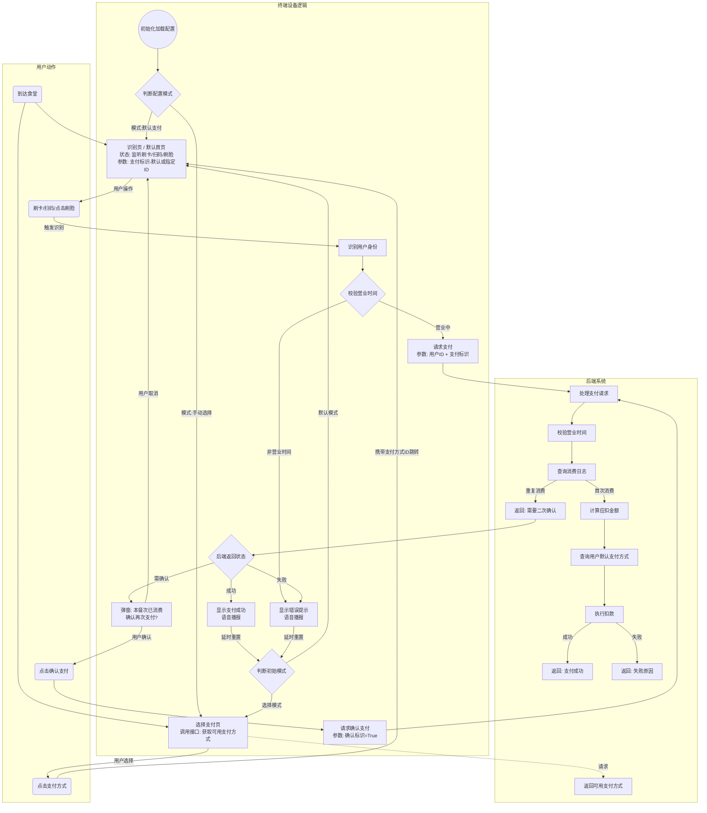

# 业务流程图 (泳道图版)

```mermaid
graph TD
    subgraph User [用户动作]
        User_Arrive(到达食堂)
        User_DirectAction(刷卡/扫码/点击刷脸)
        User_SelectMethod(点击支付方式)
        User_ConfirmRepeat(点击确认支付)
    end

    subgraph Terminal [终端设备逻辑]
        Init((初始化加载配置))
        CheckMode{判断配置模式}
        
        %% 页面复用逻辑
        Page_Identify[识别页 / 默认首页<br>状态: 监听刷卡/扫码/刷脸<br>参数: 支付标识-默认或指定ID]
        
        Page_Select[选择支付页<br>调用接口: 获取可用支付方式]
        
        %% 识别与请求
        Identify[识别用户身份]
        CheckTime{校验营业时间}
        
        %% 发起核心请求
        RequestPay[请求支付<br>参数: 用户ID + 支付标识]
        
        %% 处理后端返回的需确认状态
        HandleResponse{后端返回状态}
        Popup_Repeat[弹窗: 本餐次已消费<br>确认再次支付?]
        
        %% 再次确认请求
        RequestConfirm[请求确认支付<br>参数: 确认标识=True]
        
        %% 结果反馈
        Show_Success[显示支付成功<br>语音播报]
        Show_Error[显示错误提示<br>语音播报]
        
        %% 结束重置逻辑
        ResetCheck{判断初始模式}
    end

    subgraph Backend [后端系统]
        API_GetMethods[返回可用支付方式]
        
        API_ProcessPay[处理支付请求]
        Logic_CheckTime[校验营业时间]
        Logic_CheckLog[查询消费日志]
        Logic_GetDefault[查询用户默认支付方式]
        Logic_CalcPrice[计算应扣金额]
        Logic_Deduct[执行扣款]
        
        API_ReturnConfirm[返回: 需要二次确认]
        API_ReturnSuccess[返回: 支付成功]
        API_ReturnError[返回: 失败原因]
    end

    %% --- 流程连线 ---

    %% 初始化
    Init --> CheckMode

    %% 路径分流
    CheckMode -->|模式:默认支付| Page_Identify
    CheckMode -->|模式:手动选择| Page_Select
    
    %% 用户交互
    User_Arrive --> Page_Identify
    User_Arrive --> Page_Select
    
    %% 选择模式逻辑
    Page_Select -.->|请求| API_GetMethods
    Page_Select -->|用户选择| User_SelectMethod
    User_SelectMethod -->|携带支付方式ID跳转| Page_Identify

    %% 识别逻辑 (统一入口)
    Page_Identify -->|用户操作| User_DirectAction
    User_DirectAction -->|触发识别| Identify

    %% 前端发起请求
    Identify --> CheckTime
    CheckTime -->|非营业时间| Show_Error
    CheckTime -->|营业中| RequestPay
    
    %% 后端处理逻辑
    RequestPay --> API_ProcessPay
    API_ProcessPay --> Logic_CheckTime
    Logic_CheckTime --> Logic_CheckLog
    
    %% 分支：需要确认
    Logic_CheckLog -->|重复消费| API_ReturnConfirm
    API_ReturnConfirm --> HandleResponse
    
    %% 分支：直接扣款
    Logic_CheckLog -->|首次消费| Logic_CalcPrice
    Logic_CalcPrice --> Logic_GetDefault
    Logic_GetDefault --> Logic_Deduct
    Logic_Deduct -->|成功| API_ReturnSuccess
    Logic_Deduct -->|失败| API_ReturnError
    
    %% 前端处理响应
    HandleResponse -->|需确认| Popup_Repeat
    HandleResponse -->|成功| Show_Success
    HandleResponse -->|失败| Show_Error
    
    %% 二次确认流程
    Popup_Repeat -->|用户取消| Page_Identify
    Popup_Repeat -->|用户确认| User_ConfirmRepeat
    User_ConfirmRepeat --> RequestConfirm
    RequestConfirm --> API_ProcessPay
    
    %% 结束重置连线
    Show_Success -->|延时重置| ResetCheck
    Show_Error -->|延时重置| ResetCheck
    
    ResetCheck -->|默认模式| Page_Identify
    ResetCheck -->|选择模式| Page_Select
```
