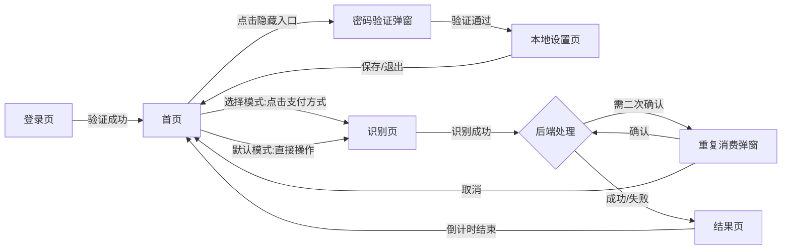

# PRD: 移动收银-按次付费功能 (Mobile Cashier - Pay Per Use)

## 1. 文档信息 (Document Information)

### 1.1 版本修订记录 (Revision History)

| 版本号  | 修订日期       | 修改描述   | 作者   |
| :--- | :--------- | :----- | :--- |
| v1.0 | 2026-03-13 | 初始版本创建 | 智能助手 |

***

## 2. 项目概述 (Project Overview)

### 2.1 背景 (Background)

*(详情见* *[Requirement\_Background.md](Background/Requirement_Background.md))*
本需求基于现有的“智慧餐饮综合管理系统”中的“移动收银”模块进行迭代升级。目前系统已支持通过移动设备进行“按金额”支付的收银模式。随着业务发展，食堂自助餐场景出现了新的收银需求：**按次付费**。

### 2.2 目标 (Goals)

- **提升效率**：通过固定设备自助核销，减少人工干预，加快入场速度。
- **灵活计费**：支持分时段（餐次）、分人群（成员类型）自动差异化定价。
- **防止误刷**：引入二次确认机制，防止用户重复扣费。

### 2.3 范围 (Scope)

- **包含**：固定收银终端 (Android/Linux)、Web 管理后台。
- **不包含**：用户移动端 (小程序/App) 功能开发（复用现有）。

***

## 3. 用户角色与故事 (User Roles & Stories)

### 3.1 用户角色 (Roles)

- **就餐者 (Diner)**：教职工、学生、访客，使用终端进行支付。
- **管理员 (Admin)**：食堂运营人员，负责配置价格策略和设备参数。

### 3.2 核心用户故事 (Core Stories)

*(详情见* *[User\_Stories.md](Background/User_Stories.md))*

### 3.3 用户旅程图 (User Journey Map)

*(详情见* *[User\_Journey\_Map.md](Flow/User_Journey_Map.md))*

***

## 4. 业务流程 (Business Process)

### 4.1 高阶业务流程图

*(详情见* *[Business\_Flow.md](Flow/Business_Flow.md))*

### 4.2 详细泳道图 (Swimlane Diagram)

*(详情见* *[Business\_Flow\_Detailed.md](Flow/Business_Flow_Detailed.md))*

***

## 5. 页面结构与流转 (Page Structure & Flow)

### 5.1 页面流转逻辑

### 5.2 页面信息结构

*(详情见* *[Page\_Structure.md](Page_Structure.md))*

***

## 6. 名词字典 (Glossary & Data Dictionary)

| 中文名称 | 定义说明 | 类型/限制 | 来源 |
| :--- | :--- | :--- | :--- |
| **餐次** | 当前营业时段的中文名称，如“早餐”、“午餐” | 文本，不可为空，最大长度20字符 | 后端根据服务器时间自动匹配 |
| **人员类型** | 用户的身份类别，如“教工”、“学生”、“访客” | 文本，不可为空，最大长度20字符 | 用户刷卡/扫码/刷脸识别后获取 |
| **支付模式** | 收银设备的工作模式，决定首页是直接刷卡还是先选支付方式 | 枚举值 (1:默认模式, 2:选择模式)，必填 | 设备端【本地设置】页面配置 |
| **业务类型** | 订单的计费方式，区分是按次扣费还是按金额扣费 | 固定字符串 "COUNT"，不可变更 | 系统生成订单时自动记录 |
| **设备序列号** | 收银设备的唯一硬件编码，用于区分订单来源 | 字母数字组合，最大长度64字符，全局唯一 | 设备出厂时写入，不可修改 |
| **基础价格** | 餐次的默认扣费金额，适用于未匹配到特殊优惠的用户 | 金额，精确到小数点后2位 (0.00-99999.99)，不可为空 | 管理后台【配置管理】中设定 |
| **特殊价格** | 针对特定人员类型的优惠金额，优先级高于基础价格 | 金额，精确到小数点后2位 (0.00-99999.99)，可为空 | 管理后台【配置管理】中设定 |
| **管理员密码** | 进入设备端本地设置页面的验证密码 | 纯数字字符串，固定6位长度 | 管理后台【配置管理】中设定 |

***

## 7. 功能详情与页面交互 (Functional & UI Specifications)

### 7.1 终端-首页 (Terminal Home)

- **页面标题**: 终端首页
- **原型链接**: [点击预览 (Prototypes/terminal\_home.html)](Prototypes/terminal_home.html)
- **UI 截图**:
  > *(请在此处插入 terminal\_home.html 的截图，展示默认模式和选择模式)*

#### 7.1.1 功能逻辑与数据来源
1.  **餐次信息 (名称/时间)**:
    *   **来源**: 后台【基础设置-餐次管理】。
    *   **逻辑**: 设备获取服务器当前时间，自动匹配落在哪个餐次的时间段内（如 11:30 落入 11:00-13:00 的午餐时段）。
2.  **价格展示**:
    *   **基础价格**: 来源于后台【移动收银-配置管理】中的“默认基础价格”配置。
    *   **特殊价格**: 来源于后台【移动收银-配置管理】中的“价格策略列表”。系统自动筛选出当前餐次下启用的所有特殊人员定价进行轮播展示。
3.  **支付模式**:
    *   **来源**: 终端【本地设置】中的“支付模式”选项。
4.  **初始化加载**: 设备启动时自动同步上述所有配置信息。
5.  **非营业状态**: 若当前时间未匹配到任何餐次，系统自动锁定支付功能，并提示“非营业时间”。

#### 7.1.2 交互说明

- **刷卡/扫码 (默认模式)**: 用户刷卡或扫码后，设备自动捕获数据，直接跳转至 **7.2 识别页逻辑**（参数 `pay_method=DEFAULT`）。
- **点击刷脸 (默认模式)**: 点击按钮 -> 弹出全屏摄像头预览 -> 识别成功后 -> 跳转至 **7.2 识别页逻辑**（参数 `pay_method=FACE`）。
- **点击支付方式 (选择模式)**: 用户点击任意图标 -> 跳转至 **7.2 识别页**（参数 `pay_method=SELECTED_ID`）。
- **二次确认触发**: 若后端返回 `4001 Repeat Consumption`，**在当前页（或识别页）** 弹出二次确认弹窗。

***

### 7.2 终端-识别页 (Identify Page)

- **页面标题**: 身份识别 / 支付确认
- **原型链接**: *(复用 terminal\_home.html 的识别状态)*

#### 7.2.1 功能逻辑与数据来源
1.  **识别方式**:
    *   **来源**: 终端硬件能力。
    *   **逻辑**: 同时激活 NFC 读卡器、二维码扫描头。若首页点击了“刷脸”，则同时开启摄像头。
2.  **支付请求**:
    *   **触发**: 一旦设备捕获到卡号、二维码或人脸特征，立即向系统发起扣费请求。
    *   **携带信息**: 用户的身份凭证 + 首页选定的支付方式 (默认/微信/支付宝等)。

#### 7.2.2 交互说明
*   **状态展示**: 屏幕动态显示“当前支付方式：[XXX]”。其中 [XXX] 来源于首页用户的选择（如“微信”）；若是默认模式，则不显示具体方式，仅提示“请刷卡/扫码”。
*   **超时机制**: 若停留在该页面超过 30 秒无任何操作，系统自动重置并返回首页。
*   **取消操作**: 用户点击【返回】按钮，放弃本次识别，返回上一级（首页或选择列表）。

***

### 7.3 终端-结果页 (Result Page)

- **页面标题**: 支付结果
- **原型链接**: [点击预览 (Prototypes/terminal\_result.html)](Prototypes/terminal_result.html)
- **UI 截图**:
  > *(请在此处插入 terminal\_result.html 的截图)*

#### 7.3.1 功能逻辑与数据来源
1.  **扣费结果**:
    *   **来源**: 后端支付系统的实时处理结果。
    *   **内容**: 包含支付金额、用户姓名、人员类型、当前余额。
2.  **低余额判断规则**:
    *   **比对对象**: 【当前用户余额】 vs 【下一餐次的基础价格】。
    *   **逻辑**: 系统自动获取下一个即将到来的餐次（如午餐后是晚餐）的默认价格。若用户余额低于该价格，则判定为“低余额”。
    *   **目的**: 提前提醒用户充值，避免下次用餐时余额不足。

#### 7.3.2 交互说明
*   **信息展示**:
    *   **金额**: 大号字体展示本次实扣金额。
    *   **人员类型**: 显示该用户享受的价格策略类型（如“教工价”）。
*   **余额隐私**: 默认以 `***` 掩码显示。点击“眼睛”图标后，显示明文余额数值。
*   **自动返回**: 页面停留 3 秒后，无需用户操作，自动跳转回首页待机。

***

### 7.4 二次确认弹窗 (Secondary Confirmation)

*   **触发逻辑**: 
    *   当系统检测到该用户在**当前餐次**内已经有一笔成功的消费记录时，自动拦截本次扣费请求，并返回“重复消费”状态。
    *   终端接收到该状态后，立即弹出此确认窗口。
*   **UI 位置**: 覆盖在当前页面之上 (Modal 模态框)。
*   **数据来源**: 弹窗中的文案（如“您在午餐已消费1次”）直接由后端系统根据查询到的历史记录生成并下发。
*   **交互说明**:
    *   **确认支付**: 用户点击后，终端向系统发送“强制支付”指令，系统将不再拦截，直接进行扣费。
    *   **取消**: 用户点击取消，流程结束，返回首页。

***

### 7.5 终端-本地设置 (Local Settings)

- **页面标题**: 本地设置
- **原型链接**: [点击预览 (Prototypes/terminal\_settings.html)](Prototypes/terminal_settings.html)

#### 7.5.1 功能逻辑与数据来源
1.  **管理员密码验证**:
    *   **来源**: 后台【配置管理-基础配置】中设置的“设备端管理员密码”。
    *   **逻辑**: 终端在本地缓存该密码。用户输入时，直接在本地进行比对，无需联网验证。
2.  **支付模式配置**:
    *   **选项**: [默认支付] / [手动选择]。
    *   **作用**: 此配置决定了首页是直接显示刷卡动画（默认），还是显示支付方式列表（选择）。
    *   **保存**: 修改后立即生效，且重启设备后依然保持该设置（持久化存储）。

***

### 7.6 后台-配置管理 (Admin Configuration)

- **页面标题**: 配置管理
- **原型链接**: [点击预览 (Prototypes/admin\_config.html)](Prototypes/admin_config.html)
- **UI 截图**:
  > *(请在此处插入 admin\_config.html 的截图)*

#### 7.6.1 基础参数设置
*   **数据来源**: 当前页面表单输入。
*   **字段**: **设备端管理员密码** (6位数字)。
*   **生效机制**: 点击保存后，系统将该密码同步下发给所有在线的终端设备；离线设备将在下次上线时获取。

#### 7.6.2 价格策略配置
*   **全局配置**: **默认基础价格** —— 当用户身份未匹配到任何特殊策略时，系统将使用此价格进行扣费。
*   **特殊策略列表**:
    *   **来源**: 管理员手动新增。
    *   **餐次**: 读取系统基础配置中的所有餐次（如早餐、午餐）。
    *   **人员类型**: 读取系统基础配置中的所有人员类型（如教工、学生）。
    *   **优先级逻辑**: 特殊策略 > 默认基础价格。系统在计费时，优先匹配特殊的餐次+人员组合。

***

## 8. 非功能性需求 (Non-functional Requirements)

### 8.1 性能要求

- **响应速度**: 从刷卡到语音播报结果，整体耗时 < 1.5s (网络延迟 < 200ms)。
- **并发支持**: 单台设备每分钟支持 20+ 人次通过。

### 8.2 安全性

- **数据传输**: 所有 API 请求需通过 HTTPS 加密。
- **敏感信息**: 余额信息在传输和日志中需加密或脱敏。

### 8.3 可靠性

- **断网处理**: 若设备离线，屏幕顶部状态栏显示“网络异常”，并弹窗提示“无法连接服务器”，禁止支付操作 (暂不支持离线记账)。

